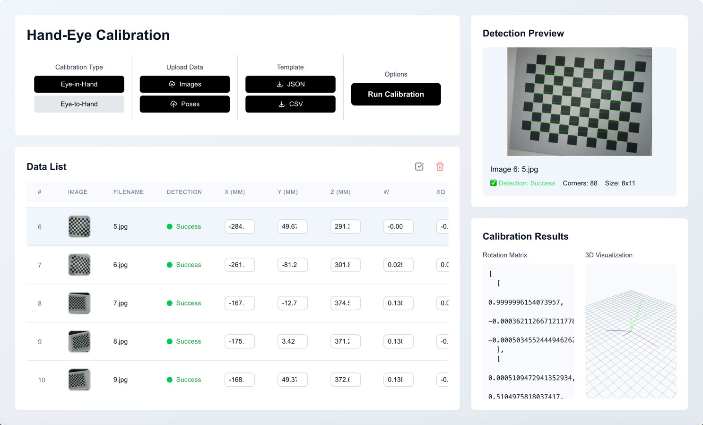

# Hand-Eye Calibrator

[](https://nextjs.org/)
[](https://react.dev/)
[](https://www.typescriptlang.org/)
[](https://threejs.org/)
[](https://huggingface.co/)

A web-based tool for hand-eye calibration with support for both eye-in-hand and eye-to-hand workflows.

The app lets you upload chessboard images, import robot TCP poses, run calibration directly in the browser, and inspect the result through 2D corner overlays and a 3D scene.



## 🚀 Features

- **Web-based workflow**: Upload images, import poses, inspect detections, and run calibration from a single Next.js interface.
- **Two calibration modes**: Supports both eye-in-hand and eye-to-hand setups.
- **Automatic chessboard detection**: Sends uploaded images to a hosted detection API and overlays detected corners on the image preview.
- **Pose import flexibility**: Accepts TCP pose files in CSV or JSON format, with either quaternion or Euler angle orientation fields.
- **3D visualization**: Displays robot TCP poses and calibration output in an interactive Three.js scene.
- **Batch data management**: Supports multi-row selection, deletion, and per-image inspection for larger calibration datasets.

## 🛠️ Architecture

This project is implemented as a client-side Next.js application with two main computational paths: hosted chessboard detection and in-browser hand-eye calibration.

- **UI layer (`/app/page.tsx`)**: Handles data upload, pose import, validation, calibration flow, and result presentation.
- **Detection service (`/app/services/chessboardDetection.ts`)**: Calls the hosted Hugging Face endpoint for chessboard corner detection.
- **Calibration service (`/app/services/handEyeCalibration.ts`)**: Performs camera pose estimation and hand-eye calibration math in TypeScript.
- **3D viewer (`/app/components/ThreeDVisualization.tsx`)**: Renders TCP poses and calibration results using Three.js.

## 🏁 Getting Started

### Prerequisites

- Node.js 18 or higher
- npm 9 or higher
- Internet access to reach the hosted chessboard detection API

### Local Development

```bash
# Install dependencies
npm install

# Start the development server
npm run dev
```

Open `http://localhost:3000` in your browser.

No additional backend setup is required for the default workflow. The app uses the hosted detection endpoint defined in `app/services/chessboardDetection.ts`.

## 📋 Usage

1. Upload chessboard images from the `Images` button.
2. Import TCP poses from the `Poses` button.
3. Verify that image names and pose `file_name` fields match exactly.
4. Review the detected chessboard corners in the preview panel.
5. Choose `eye-in-hand` or `eye-to-hand` calibration.
6. Run calibration and inspect the resulting rotation, translation, and 3D visualization.

Sample input files are included in `test_data/`.

## 🧾 Pose File Format

The app accepts `.csv` and `.json` pose files.

### CSV

Required columns:

- `file_name`
- `x`, `y`, `z`
- Either `w`, `xq`, `yq`, `zq` for quaternion input
- Or `rx`, `ry`, `rz` for Euler input

Notes:

- Position units are expected to be millimeters.
- Quaternion format is `wxyz`.
- Euler angles are interpreted as degrees during import.
- The number of pose rows must match the number of uploaded images.

Example:

```csv
file_name,x,y,z,rx,ry,rz
0.jpg,-141.769,3.565,333.489,179.051,-23.447,-174.306
1.jpg,-233.661,-23.157,293.296,173.685,-7.638,-175.163
```

### JSON

Expected shape:

```json
{
  "poses": [
    {
      "file_name": "image1.jpg",
      "x": 0.0,
      "y": 0.0,
      "z": 0.0,
      "w": 1.0,
      "xq": 0.0,
      "yq": 0.0,
      "zq": 0.0
    }
  ]
}
```

Template files can also be downloaded directly from the UI.

## 📦 Deployment

This repository can be deployed as a standard Next.js application.

- **Frontend**: Deploy to any platform that supports Next.js, such as Vercel or a Node-based hosting environment.
- **Detection API dependency**: The default app configuration uses the hosted Hugging Face endpoint in `app/services/chessboardDetection.ts`.
- **If you self-host detection**: Update the API base URL in `app/services/chessboardDetection.ts` to point to your own service.

## ⚠️ Notes

- Chessboard detection depends on the hosted remote service being reachable.
- Calibration requires at least 3 valid pose/image pairs.
- Pose import is order-independent, but `file_name` values must match uploaded image names exactly.

## 📄 License

This project is licensed under the MIT License. See the [LICENSE](./LICENSE) file for details.
